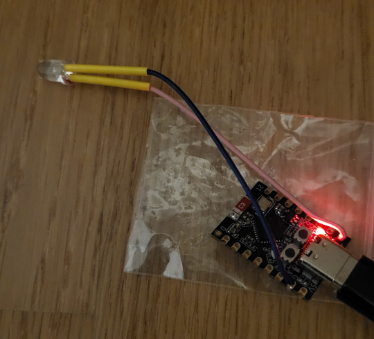
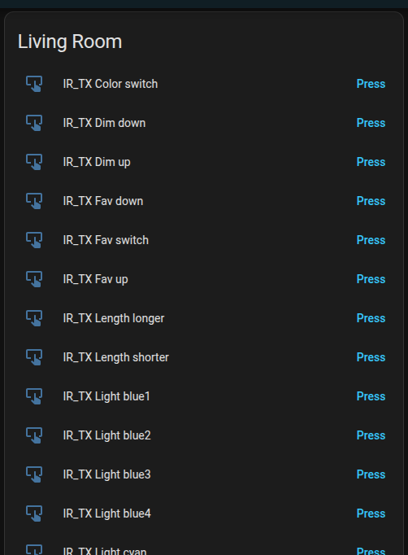

# esphome_casalux_led_ir_transmitter

Small ESPhome configuration for an ESP32-based IR transmitter to control the CASALUX LED floor lamb (Aldi). This project exposes the lamb's IR commands to Home Assistant using template buttons and the ESPhome remote transmitter.

## Features
- Transmit Pioneer-style IR codes to control power, colors, programs and modes.
- Template buttons for each remote function, visible in Home Assistant.
- Optional IR receiver mode to record remote signals.

## Usecase
I have set it up to control the led light via IR without having to modify it. The ESP32 can be easily installed somewhere in the vicinity of the lamb. 
I then used Home Assistant to set up an automation when one of the hygrometers in various rooms are signaling an humidity above a threshold. Then the lamb is turned on and set to a specific color. Once it is back below the threshold the lamb is turned off again. :D

## Hardware
- ESP32 board (configured for `esp32-c3-devkitm-1` in [ir-tx.yaml](ir-tx.yaml))
- IR LED/transmitter on GPIO5 (see [`remote_transmitter`](ir-tx.yaml))
- Optional IR receiver on GPIO4 (uncomment receiver section in [ir-tx.yaml](ir-tx.yaml) to record signals)

## Configuration
- Adjust these fields for your environment:
  - Board and framework
  - `api.encryption.key`, OTA password
  - Wi‑Fi secrets
  - GPIO pins and carrier duty if needed

## Deploy
1. Install Home Assistant, add ESPHome plugin to it.
2. Flash initial esphome fw on your ESP32.
3. After discovery in ESPHome, add script contained in ir-tx.yaml and adjust according to your needs.
4. Let the configuration be uploaded onto the device.
5. See new buttons on your Home Assistant Overview page 
